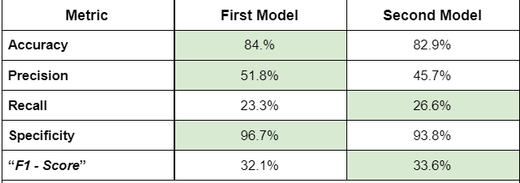

```{r setup, include=FALSE}
knitr::opts_chunk$set(echo = TRUE)
listOfPackages <- c("tidyverse", "magrittr", "xgboost", 
                    "caret", "tidymodels", "DiagrammeR",
                    "doParallel")

for (i in listOfPackages){
  if(! i %in% installed.packages()){
    install.packages(i, dependencies = TRUE)
  }
  lapply(i, require, character.only = TRUE)
  rm(i)
}

data <- read_csv("dataset/XGBoost.csv")
attrition <- data

attrition %<>%
  select(c("Age", "Attrition_XGBoost",
           "BusinessTravel", "Education",
           "JobLevel", "MonthlyIncome",
           "OverTime")) %>%
  rename("Attrition" = "Attrition_XGBoost")

set.seed(1)
attrition_split <- initial_split(attrition, strata = Attrition)
attrition_train <- training(attrition_split)
attrition_test <- testing(attrition_split)

trainY <-  attrition_train$Attrition == "1"
trainX <- model.matrix(Attrition ~.-1, data = attrition_train)

testY <- attrition_test$Attrition == "1"
testX <- model.matrix(Attrition ~. -1, data = attrition_test)

# DMatrix
Xmatrix_training <-  xgb.DMatrix(data = trainX, label = trainY)
Xmatrix_testing <-xgb.DMatrix(data = testX, label = testY)

Xgboosting <- xgboost(data = Xmatrix_training,
                      objective = "multi:softmax",
                      num_class = 2,
                      nrounds = 51,
                      eval_metric="merror"
)
# Predicting
xgpred <- predict(Xgboosting, Xmatrix_testing)
my_table <- table(testY, xgpred, dnn = c("Actual", "Predicted"))
# Metrics
TP <- my_table [2,2]
TN <- my_table [1,1]
FP <- my_table [1,2]
FN <- my_table [2,1]
# Accuracy
accuracy <- sum(TP, TN)/sum(TP,FP,FN,TN)
# Recall
recall<- TP/(sum(TP, FN)) 
# Specificity
specificity <- TN/(sum(TN,FP))
# Precision
precision <-  TP/ sum(TP,FP)
# F1
F1 <- 2*(recall * precision)/(recall+precision)
err <- mean(as.numeric(xgpred > 0.5) != testY)

# Second Model
# Using tuned params

Xgboosting2 <- xgboost(data = Xmatrix_training,
                       objective = "multi:softmax",
                       num_class = 2,
                       nrounds = 251,
                       eval_metric = "merror",
                       max_depth = 10,
                       eta = 0.2276,
                       subsample = 0.8562,
                       colsample_bytree = 0.9899,
                       min_child_weight = 5,
                       gamma = 0,
                       alpha = 0.04643,
                       lambda = 0.8723,
                       set.seed(1)
)

# Predicting
xgpred2 <- predict(Xgboosting2, Xmatrix_testing)
my_table2 <- table(testY, xgpred2, dnn = c("Actual", "Predicted"))
# Metrics
TP_2 <- my_table2 [2,2]
TN_2 <- my_table2 [1,1]
FP_2 <- my_table2 [1,2]
FN_2 <- my_table2 [2,1]
# Accuracy
accuracy_2 <- sum(TP_2, TN_2)/sum(TP_2,FP_2,FN_2,TN_2)
# Recall
recall_2<- TP_2/(sum(TP_2, FN_2)) 
# Specificity
specificity_2 <- TN_2/(sum(TN_2,FP_2))
# Precision
precision_2 <-  TP_2/ sum(TP_2,FP_2)
# F1
F1_2 <- 2*(recall_2 * precision_2)/(recall_2+precision_2)
err_2 <- mean(as.numeric(xgpred2 > 0.5) != testY)
```

The dataset is composed of `r nrow(data)` observations and `r ncol(data)` attributes. For this model we will be using 7 out of the original 35 attributes. The variables to include are the following: "Age", “Attrition”, "Business Travel", "Education", "Job Level", “Monthly Income” and "OverTime".
    
We will create a XGBoosting model to predict "Attrition", which refers to whether the employee left or not the company. Then, we will try to optimize the model to increase the recall. We want to detect the people who left the company.
  
Dataset contains no missing values. Here, the structure of our data:
```{r echo=FALSE}
str(attrition)
```
  
We proceed to divide the data set into training and test with a proportion of 75% in the former and 25% in the latter. The independent variables selected were: "Age", "Attrition", "Business Travel", "Education", "Job Level", "Monthly Income", "Over Time".
```{r echo=FALSE}
print(attrition_split)
```
  
This algorithm only allows independent variables of numerical type, therefore the "One Hot Encoding" process must be performed and a matrix must be provided as required.
```{r eval=FALSE}
trainY <-  attrition_train$Attrition == "1"
trainX <- model.matrix(Attrition ~.-1, data = attrition_train)

testY <- attrition_test$Attrition == "1"
testX <- model.matrix(Attrition ~. -1, data = attrition_test)

# DMatrix
Xmatrix_training <-  xgb.DMatrix(data = trainX, label = trainY)
Xmatrix_testing <-xgb.DMatrix(data = testX, label = testY)
```
  
We then proceed to create the model, make the predicions and see its results:
```{r eval=FALSE}
Xgboosting <- xgboost(data = Xmatrix_training,
                      objective = "multi:softmax",
                      num_class = 2,
                      nrounds = 51,
                      eval_metric="merror"
)
```
  
```{r echo=FALSE}
# Predicting

print(my_table)

# Metrics

sprintf("Accuracy: %f", accuracy)
## Recall
sprintf("Recall: %f", recall[1])
## Specificity
sprintf("Specificity: %f", specificity[1])
## Precision
sprintf("Precision: %f", precision)
## F1
sprintf("F1 Score: %f", F1)
```
  
According to **accuracy**, the model correctly predicted 84% of the cases.
  
According to **precision**, of all the people that the model classified as "Yes", only 51.8% of the cases actually left the company.
  
According to **sensitivity**, of all the people who left the company, the model was correct in 23.3% of the cases.
  
According to the **specificity**, out of a total of 309 people who did not leave the company, the model correctly predicted 95.7% of the observations.
  
The **"F1 - Score"** has a value of 32.1%.
  
In order to optimize the parameters for this model, the grid search strategy was used and 10,000 models with different parameter values were created Once the previous iteration was completed, the best performing model was selected according to the multiple error metric. The hyper parameters are as follows:
  
* "eta": controls the learning rate. It takes a value within the interval [0, 1].
  
* "max_depth": controls the depth of the tree. The greater the depth, the greater the complexity of the model, the greater the chance of overfitting. It takes a value within the interval [0, infinite].
  
* "gamma": controls the regularization. The higher the value, the greater the regularization. Regularization penalizes large coefficients that do not improve model performance.It takes a value within the interval [0, infinite].
  
* "subsample: controls the number of observations supplied to a tree. It takes a value within the interval [0, 1].
  
* "colsample_bytree": controls the number of features (variables) supplied to a tree. It takes a value within the interval [0, 1].
  
* "min_child_weight": value that determines whether the tree splitting stops.It takes a value within the interval [0, infinite].
  
* "alpha": controls the L1 regularization (equivalent to Lasso regression) in the weights.
  
* "lambda": controls the L2 regularization (equivalent to Ridge regression) in the weights. It is used to avoid over-fitting.
  
```{r eval=FALSE}

cl <- makePSOCKcluster(9) # I have found this number is optimal for my pc. 
registerDoParallel(cl) # You could also run it without doParallel library, just will take longer

# Take start time to measure time of random search algorithm
start.time <- proc.time()

# Create empty lists
lowest_merror_list = list()
parameters_list = list()

# Create 10,000 rows with random hyperparameters

set.seed(20)
for (iter in 1:10000){
  param <- list(booster = "gbtree",
                objective = "multi:softmax",
                max_depth = sample(3:10, 1),
                eta = runif(1, .01, .3),
                subsample = runif(1, .7, 1),
                colsample_bytree = runif(1, .6, 1),
                min_child_weight = sample(0:10, 1),
                gamma = floor(runif(1, 0, 100)),
                alpha = runif(1, 0, 100),
                lambda = runif(1, 0, 100)
                
  )
  parameters <- as.data.frame(param)
  parameters_list[[iter]] <- parameters
}

# Create object that contains all randomly created hyperparameters
parameters_df = do.call(rbind, parameters_list)

# Use randomly created parameters to create 10,000 XGBoost-models

for (row in 1:nrow(parameters_df)){
  set.seed(20)
  mdcv <- xgb.train(data=Xmatrix_training,
                    booster = "gbtree",
                    objective = "multi:softmax",
                    max_depth = parameters_df$max_depth[row],
                    eta = parameters_df$eta[row],
                    subsample = parameters_df$subsample[row],
                    colsample_bytree = parameters_df$colsample_bytree[row],
                    min_child_weight = parameters_df$min_child_weight[row],
                    gamma = parameters_df$gamma[row],
                    alpha = parameters_df$alpha[row],
                    lambda = parameters_df$lambda[row],
                    nrounds= 351,
                    eval_metric = "merror",
                    early_stopping_rounds= 30,
                    print_every_n = 100,
                    num_class = 2,
                    watchlist = list(train= Xmatrix_training, val= Xmatrix_testing)
  )
  lowest_merror <-  as.data.frame(1 - min(mdcv$evaluation_log$val_merror))
  lowest_merror_list[[row]] = lowest_merror
}

# Create object that contains all accuracy's
lowest_merror_df = do.call(rbind, lowest_merror_list)

# Bind columns of accuracy values and random hyperparameter values
randomsearch = cbind(lowest_merror_df, parameters_df)

# Quickly display highest accuracy
maxacc <- max(randomsearch$`1 - min(mdcv$evaluation_log$val_merror)`)
print(randomsearch %>% filter(`1 - min(mdcv$evaluation_log$val_merror)` == maxacc))

# Stop time and calculate difference
end.time <- proc.time()
time.taken <- end.time - start.time
print(time.taken)

write_csv(randomsearch, "dataset/randomsearch.csv")

stopCluster(cl)

## Best Parameters 
# 0.859079
# max_depth = 10
# eta = 0.2276653
# subsample = 0.8562708
# colsample_bytree = 0.9899229
# min_child_weight = 5
# gamma = 0
# alpha = 0.04643467
# lambda = 0.8723213
```
  
With these new values for the hyper parameters, the model is trained again:
```{r eval=FALSE}
# Using tuned params

Xgboosting2 <- xgboost(data = Xmatrix_training,
                       objective = "multi:softmax",
                       num_class = 2,
                       nrounds = 251,
                       eval_metric = "merror",
                       max_depth = 10,
                       eta = 0.2276,
                       subsample = 0.8562,
                       colsample_bytree = 0.9899,
                       min_child_weight = 5,
                       gamma = 0,
                       alpha = 0.04643,
                       lambda = 0.8723,
                       set.seed(1)
)

```
  
```{r echo=FALSE}
# Predicting
xgpred2 <- predict(Xgboosting2, Xmatrix_testing)
my_table2 <- table(testY, xgpred2, dnn = c("Actual", "Predicted"))
print(my_table2)
# Metrics
TP_2 <- my_table2 [2,2]
TN_2 <- my_table2 [1,1]
FP_2 <- my_table2 [1,2]
FN_2 <- my_table2 [2,1]
# Accuracy
sprintf("Accuracy: %f", accuracy_2)
# Recall
sprintf("Recall: %f", recall_2)
# Specificity
sprintf("Specificity: %f", specificity_2)
# Precision
sprintf("Precision: %f", precision_2)
# F1
sprintf("F1 Score: %f", F1_2)
```
  
According to **accuracy**, the model predicted correctly in 82.9% of the cases.
  
According to **precision**, of all the people that the model classified as "Yes", only 45.7% of the cases actually left the company.
  
According to **sensitivity**, of all the people who left the company, the model was correct in 26.6% of the cases.
  
According to **specificity**, out of a total of 309 people who did not leave the company, the model correctly predicted 93.8% of the observations.
  
The **"F1 - Score"** has a value of 33.6%.
  
The importance of variables according to the model constructed is shown below:
```{r}
# Feature Importance
importance_matrix <- xgb.importance(model = Xgboosting2)
print(importance_matrix)
xgb.plot.importance(importance_matrix = importance_matrix[1:3,], 
                    main = "Feature Importance \n Top 3",
                    xlab = "Gain"
)
```
  
The three variables with the greatest impact on the model are: "Monthly Income", "Age" and "Over Time".
  
## Comparing Both Models
  
 
  
Although the improvement in the recall is not that much, it did improve.
  
**Thanks you for your attention.**
